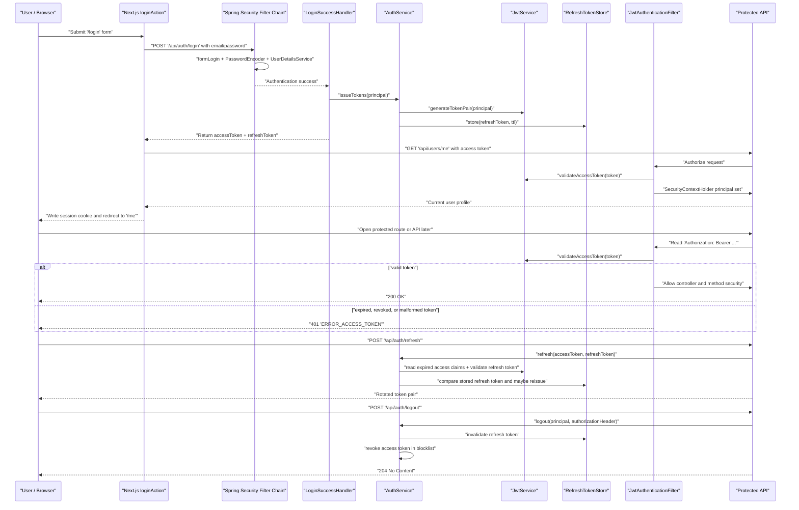
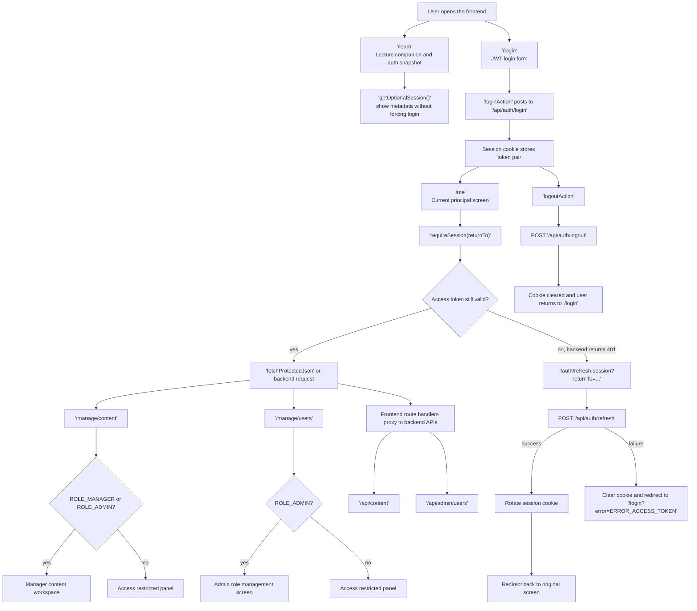

# Spring Security Notebook


이 저장소는 `Spring Boot + Next.js(React)` 기반 프로젝트로 Spring Security 클린 패턴을 실습하고 정리하기 위한 학습용 레포지토리입니다. 문서 학습에 그치지 않고, 백엔드 인증 구조와 프론트엔드 인증 흐름을 함께 연결해 보면서 `Spring Security + JWT` 아키텍처를 단계적으로 구현하는 것을 목표로 합니다.

## Project Goal

- Spring Boot 백엔드와 Next.js 프론트엔드를 함께 구성하며 인증/인가 흐름을 실습합니다.
- `SecurityFilterChain`, `UserDetails`, `UserDetailsService`, JWT 발급/검증, Refresh Token 전략을 단계적으로 구현합니다.
- Spring Security를 단순 설정 모음이 아니라 역할이 분리된 클린 패턴 관점으로 이해합니다.
- 구현 가이드, 테스트 포인트, 보안상 주의점을 문서와 코드 흐름으로 함께 축적합니다.

## Project Direction

이 프로젝트는 다음 원칙으로 진행합니다.

- 프로젝트 형태는 `Spring Boot backend + Next.js frontend` 조합으로 진행합니다.
- Spring Boot 일반 구현 가이드는 설치된 `java-springboot` 스킬을 참고합니다.
- Spring Security 보안 학습과 참고 자료는 `notebooklm` 기반 README 및 학습 문서 흐름을 우선 사용합니다.
- 프론트엔드는 `create-next-app`, 백엔드는 `start.spring.io` 공식 템플릿을 기준으로 확장합니다.
- 개발 순서는 강의 순서와 동일하게 가져갑니다.
- 즉, `docs/spring-security-notebooklm-docs/`의 문서 번호가 곧 실습 및 구현 순서입니다.
- 앞 문서에서 만든 개념과 구조를 다음 단계의 기반으로 삼으며, 번호를 건너뛰지 않고 순차적으로 진행합니다.

## Why JWT In This Project

Spring Security가 JWT만을 권장하는 것은 아닙니다. 세션 기반 인증도 여전히 표준적인 선택지이며, 서버 렌더링 웹 애플리케이션이나 전통적인 폼 로그인 중심 구조에서는 세션이 더 자연스러울 수 있습니다.

그럼에도 이 프로젝트가 JWT 중심으로 진행되는 이유는 다음과 같습니다.

- 이 저장소의 목표가 `Spring Boot backend + Next.js frontend` 조합에서 백엔드와 프론트엔드 인증 흐름을 함께 학습하는 것이기 때문입니다.
- 프로젝트의 주요 인터페이스가 서버 템플릿 렌더링보다 `REST API` 호출 흐름에 가깝기 때문에, 요청마다 토큰을 검증하는 stateless 구조를 연습하기에 적합합니다.
- `SecurityFilterChain`, `UserDetailsService`, 로그인 성공 핸들러, JWT 검증 필터, `SecurityContextHolder` 연결 과정을 단계적으로 드러내기 좋습니다.
- Access Token과 Refresh Token을 분리하여 발급, 만료, 재발급, 예외 처리까지 한 번에 학습할 수 있습니다.
- Next.js 프론트엔드에서 로그인 상태 유지, 보호된 API 호출, 만료 시 refresh 재시도 같은 현대적인 인증 흐름을 연결해서 실습하기 쉽습니다.
- 프론트엔드와 백엔드가 분리된 구조, 모바일 앱 연동, 외부 클라이언트 소비 같은 확장 시나리오를 설명하기에 JWT가 더 직접적입니다.
- 실무에서는 세션과 JWT가 모두 쓰이지만, 최근 학습 자료와 API 중심 서비스에서는 JWT 기반 예제가 많아 재사용 가능한 학습 자산을 만들기 좋습니다.

즉, 이 프로젝트는 "Spring Security의 유일한 정답이 JWT"라는 전제로 진행하는 것이 아니라, 세션도 유효한 선택지임을 인정한 상태에서 현재 레포의 학습 목표와 아키텍처에 더 잘 맞는 예제로 JWT를 채택합니다.

## Directory Structure

아래 구조는 공식 템플릿 생성 이후의 현재 기본 구조입니다.

```text
spring-security-notebook/
├─ backend/
│  ├─ .mvn/wrapper/
│  ├─ mvnw
│  ├─ mvnw.cmd
│  ├─ pom.xml
│  ├─ HELP.md
│  └─ src/
│     ├─ main/java/
│     ├─ main/resources/
│     └─ test/java/
├─ frontend/
│  ├─ src/app/
│  ├─ public/
│  ├─ package.json
│  ├─ next.config.ts
│  ├─ tsconfig.json
│  └─ README.md
├─ docs/
│  ├─ spring-security-notebooklm-docs/
│  ├─ spring-security-architecture-jwt-study-guide.md
│  └─ superpowers/plans/
├─ AGENTS.md
└─ README.md
```

각 영역의 실습 초점은 다음과 같습니다.

- `backend`: `start.spring.io`로 생성한 Spring Boot 프로젝트이며 현재는 Maven wrapper, JPA, Security, Validation, PostgreSQL, Valkey 연동, Actuator 구성을 포함합니다.
- `frontend`: `create-next-app`으로 생성한 Next.js App Router 프로젝트이며 현재는 TypeScript, ESLint, Tailwind 기본 구성을 포함합니다.
- `target/`, `.next/`, `node_modules/` 같은 빌드 산출물은 문서 구조 설명에서 제외합니다.

## Study Materials

- 핵심 요약 가이드: [spring-security-architecture-jwt-study-guide.md](docs/spring-security-architecture-jwt-study-guide.md)
- 강의 구현 audit: [spring-security-lecture-gap-audit.md](docs/spring-security-lecture-gap-audit.md)
- 백엔드 step-by-step 분석: [spring-security-backend-lecture-step-analysis.md](docs/spring-security-backend-lecture-step-analysis.md)
- 구현 설계 문서: [2026-04-27-spring-security-lecture-gap-audit-design.md](docs/superpowers/specs/2026-04-27-spring-security-lecture-gap-audit-design.md)
- 단계별 실습 문서:
  - [01-concepts-and-architecture.md](docs/spring-security-notebooklm-docs/01-concepts-and-architecture.md)
  - [02-security-config.md](docs/spring-security-notebooklm-docs/02-security-config.md)
  - [03-user-entity-repository-test.md](docs/spring-security-notebooklm-docs/03-user-entity-repository-test.md)
  - [04-userdetails-and-userservice.md](docs/spring-security-notebooklm-docs/04-userdetails-and-userservice.md)
  - [05-success-failure-handler-and-jwt-creation.md](docs/spring-security-notebooklm-docs/05-success-failure-handler-and-jwt-creation.md)
  - [06-jwt-authentication-filter.md](docs/spring-security-notebooklm-docs/06-jwt-authentication-filter.md)
  - [07-bearer-token-testing-and-review.md](docs/spring-security-notebooklm-docs/07-bearer-token-testing-and-review.md)
  - [08-jwt-payload-and-error-handling.md](docs/spring-security-notebooklm-docs/08-jwt-payload-and-error-handling.md)
  - [09-refresh-token-controller.md](docs/spring-security-notebooklm-docs/09-refresh-token-controller.md)
  - [10-final-review.md](docs/spring-security-notebooklm-docs/10-final-review.md)

## Development Order

실습은 아래 순서대로 진행합니다.

1. [01-concepts-and-architecture.md](docs/spring-security-notebooklm-docs/01-concepts-and-architecture.md): 전체 인증/인가 구조 이해
2. [02-security-config.md](docs/spring-security-notebooklm-docs/02-security-config.md): `SecurityConfig`, CORS, CSRF, 세션 정책 구성
3. [03-user-entity-repository-test.md](docs/spring-security-notebooklm-docs/03-user-entity-repository-test.md): 사용자 엔티티, 리포지토리, 테스트 기반 준비
4. [04-userdetails-and-userservice.md](docs/spring-security-notebooklm-docs/04-userdetails-and-userservice.md): Security World와 사용자 도메인 연결
5. [05-success-failure-handler-and-jwt-creation.md](docs/spring-security-notebooklm-docs/05-success-failure-handler-and-jwt-creation.md): 로그인 성공/실패 처리와 JWT 발급
6. [06-jwt-authentication-filter.md](docs/spring-security-notebooklm-docs/06-jwt-authentication-filter.md): 요청 필터에서 JWT 인증 처리
7. [07-bearer-token-testing-and-review.md](docs/spring-security-notebooklm-docs/07-bearer-token-testing-and-review.md): Bearer 토큰 테스트와 흐름 점검
8. [08-jwt-payload-and-error-handling.md](docs/spring-security-notebooklm-docs/08-jwt-payload-and-error-handling.md): JWT payload 설계와 예외 응답 정리
9. [09-refresh-token-controller.md](docs/spring-security-notebooklm-docs/09-refresh-token-controller.md): Refresh Token 재발급 흐름 구현
10. [10-final-review.md](docs/spring-security-notebooklm-docs/10-final-review.md): 전체 아키텍처 복습과 마무리 점검

## Recommended Learning Flow

1. 먼저 [spring-security-architecture-jwt-study-guide.md](docs/spring-security-architecture-jwt-study-guide.md)로 전체 구조를 훑습니다.
2. 이후 `docs/spring-security-notebooklm-docs/` 문서를 번호 순서대로 따라가며 구현합니다.
3. 백엔드 인증 흐름과 Next.js 프론트엔드 인증 흐름을 함께 연결해서 점검합니다.
4. 마지막에는 JWT 발급, 인증 필터, Refresh Token, 예외 처리, 테스트 흐름을 하나의 시스템으로 복습합니다.

## Visual Security Flow

아래 다이어그램은 이 레포에서 학습하는 핵심 보안 흐름과 화면 관리 흐름을 한눈에 볼 수 있도록 요약한 것입니다.

### Backend Security Flow



### Screen And Session Flow



이 흐름에서 `401`은 인증 정보가 없거나 토큰이 만료·폐기된 경우를 의미하고, `403`은 인증은 되었지만 필요한 role이 부족한 경우를 의미합니다.

## Learning Surface

- 브라우저 학습 페이지: `frontend` 실행 후 `/learn`
- 이 페이지에서는 현재 인증 상태, role, token TTL 메타데이터, `401/403` 차이, refresh 재시도, logout 이후 무효화 포인트를 강의 흐름과 함께 확인할 수 있습니다.
- raw JWT 문자열은 노출하지 않고 학습에 필요한 메타데이터만 보여줍니다.

## Testing Workflow

- 프론트엔드는 `TDD`를 기본 작업 방식으로 사용합니다. 새 기능이나 버그 수정은 먼저 failing test부터 작성합니다.
- 프론트 테스트는 두 층으로 나눕니다.
  - `unit`: 순수 함수, 에러 매핑, 리다이렉트/path helper, role 기반 navigation 계산
  - `component`: `MSW + RTL + Vitest(jsdom)` 기반 client component 사용자 흐름
- `async` server component는 직접 테스트하지 않고, 테스트 가능한 pure helper 또는 작은 view seam으로 분리해서 검증합니다.
- 프론트 기본 검증 명령은 아래 순서를 권장합니다.
  - `cd frontend`
  - `npm run lint`
  - `npm run test:unit`
  - `npm run test:components`
  - `npm test`
  - `npm run build`

## Local Infra Quick Start

이 프로젝트의 로컬 인프라는 `Docker Desktop + docker compose` 기준으로 관리합니다.

1. 루트에서 환경 파일을 준비합니다.
   - `Copy-Item .env.example .env`
2. 인프라를 실행합니다.
   - `docker compose up -d`
3. backend 테스트로 PostgreSQL/Valkey 연결을 확인합니다.
   - `cd backend`
   - `.\mvnw.cmd test`

기본 서비스는 아래 두 가지입니다.

- PostgreSQL: `localhost:5432`
- Valkey: `localhost:6379`

백엔드 헬스 엔드포인트는 `http://localhost:8080/actuator/health`입니다.

### Backend Run Scripts

백엔드 실행 시 `.env`를 매번 터미널에 수동 주입하지 않도록 루트 `scripts/` 아래에 OS별 실행 스크립트를 둡니다.

- Windows PowerShell:
  - `.\scripts\run-backend.ps1`
  - dev profile: `.\scripts\run-backend.ps1 -Dev`
  - infra skip: `.\scripts\run-backend.ps1 -SkipInfra`
- Linux/macOS shell:
  - `bash ./scripts/run-backend.sh`
  - dev profile: `bash ./scripts/run-backend.sh --dev`
  - infra skip: `bash ./scripts/run-backend.sh --skip-infra`

두 스크립트는 공통적으로 아래 동작을 수행합니다.

- 루트 `.env`를 읽어 `APP_JWT_SECRET` 등 실행 환경변수를 현재 프로세스에 주입
- `APP_JWT_SECRET` 길이가 32자 미만이면 즉시 실패
- 기본적으로 `docker compose up -d`로 PostgreSQL/Valkey를 먼저 보장
- 이후 `backend` 디렉터리에서 Spring Boot를 실행

## Backend Runtime Notes

- 백엔드는 이제 `APP_JWT_SECRET` 없이 기동하지 않도록 구성했습니다. 로컬 실행 전 루트 `.env` 또는 실행 환경에 JWT secret을 반드시 설정해야 합니다.
- 데모 계정과 샘플 콘텐츠 bootstrap은 기본적으로 비활성화되어 있습니다.
- 로컬 학습용으로 데모 데이터를 자동 주입하려면 `dev` 프로필로 실행하거나 `APP_BOOTSTRAP_DEMO_DATA_ENABLED=true`를 명시적으로 설정합니다.
- `application-test.yml`은 테스트 전용 JWT secret을 별도로 사용하므로 `.\mvnw.cmd test` 실행에는 추가 수동 설정이 필요하지 않습니다.

## Service Token Hardening Notes

- Content service tokens are optional server-to-server credentials for cached content reads.
- They are static bearer credentials in this learning project. If the Next.js server runtime is compromised, assume environment variables and in-memory token values may be exposed.
- The intended defense is least privilege: service tokens are read-only machine credentials and do not grant subscriber roles or write/admin permissions.
- Frontend cached content helpers must still check the current user session and role before using a service token for backend fetches.
- In shared environments, pair token rotation with source restrictions such as ingress, VPC, firewall, security group, or API gateway allowlists.
- Design details: [2026-04-30-service-token-hardening-design.md](docs/superpowers/specs/2026-04-30-service-token-hardening-design.md)

## Guide Summary

이 레포의 학습 축은 다음과 같습니다.

- Spring Security는 필터 체인 기반으로 요청을 가로채고 인증/인가를 처리합니다.
- JWT 기반 구성에서는 보통 `SessionCreationPolicy.STATELESS`를 사용하고 서버 세션 상태를 최소화합니다.
- 사용자 정보는 `Entity`, `Repository`, `UserDetails`, `UserDetailsService`를 통해 Security 세계와 연결됩니다.
- 로그인 성공 시 JWT를 발급하고, 요청마다 필터에서 토큰을 검증해 `SecurityContextHolder`에 인증 정보를 저장합니다.
- 프론트엔드는 발급된 토큰을 이용해 로그인 상태를 유지하고 보호된 페이지 및 API 호출 흐름을 제어합니다.
- 실무에서는 Access Token / Refresh Token 분리, 에러 핸들러 구성, 민감 정보 제외, 충분한 길이의 시크릿 키 사용이 중요합니다.

## Skill Usage

이 저장소는 스프링 시큐리티 관련 자료를 정리하거나 확장할 때 설치된 `notebooklm` 스킬을 활용하는 것을 전제로 합니다.

- `notebooklm` 스킬은 학습 자료 요약, 보충 설명, 질의응답, 실습용 아티팩트 생성에 사용합니다.
- 프론트엔드 현대화 작업은 repo-local `modernize-next-react19` 스킬을 우선 사용하고, 브라우저 확인이 필요할 때 그 흐름 안에서 `next-browser`를 사용합니다.
- 개인정보 또는 계정 식별에 해당하는 notebook id, 인증 정보, 로컬 계정 정보는 문서에 기록하지 않습니다.
- 스킬 호출 여부와 운영 규칙은 [AGENTS.md](AGENTS.md)에서 관리합니다.
